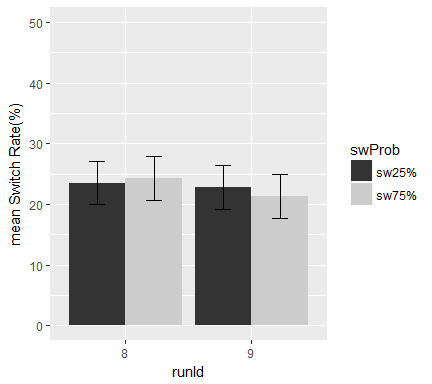

    knitr::opts_chunk$set(fig.width=6, fig.height=4, fig.path='figure/', echo = FALSE, warning = FALSE, message = FALSE)

#### First, Set up the environment and load the data: validgpData.csv

This file came from python scripts - cleaning and preprocessing

#### Set up some formating for the plots

Set up some good format, here I am using apatheme with white background,
with black axis lines, no grids.

#### First summarize individual subject's data

#### Then, calculate the group mean and within-subject SEM using "getWSSE" (a function I wrote)

    ## [1] "cued: swCost:75% = 92.03 ms"

    ## [1] "cude: swCost:25% = 109.79 ms"

    ## [1] "choice: swCost:75% = 48.07 ms"

    ## [1] "choice: swCost:25% = 48.51 ms"

### RESULTS:

#### Figure 1: ISSP(swProb x trialtype) effect in **RT** by block type (cued vs. choice)

 \#\#\#\# 3-way ANOVA: RT ~ 2 bkType x 2 swProb
x 2 trialType

    ## $ANOVA
    ##                    Effect DFn DFd          SSn        SSd           F
    ## 1             (Intercept)   1  43 2.156716e+08 1539815.82 6022.720140
    ## 2                  bkType   1  43 1.889248e+05  559547.90   14.518449
    ## 3                  swProb   1  43 8.099898e+03   41025.50    8.489734
    ## 4               trialType   1  43 4.897413e+05  124769.56  168.782158
    ## 5           bkType:swProb   1  43 2.313216e+03   31196.24    3.188470
    ## 6        bkType:trialType   1  43 6.091032e+04   85832.87   30.514464
    ## 7        swProb:trialType   1  43 1.821206e+03   25590.97    3.060136
    ## 8 bkType:swProb:trialType   1  43 1.649097e+03   28433.58    2.493923
    ##              p p<.05          ges
    ## 1 7.443170e-48     * 0.9888302387
    ## 2 4.367866e-04     * 0.0719675992
    ## 3 5.647006e-03     * 0.0033137737
    ## 4 1.747778e-16     * 0.1673783483
    ## 5 8.121329e-02       0.0009486125
    ## 6 1.792513e-06     * 0.0243922022
    ## 7 8.736987e-02       0.0007469978
    ## 8 1.216156e-01       0.0006764522

#### 2-way ANOVA: RT ~ 2 swProb x 2 trialType \[cued condition only\]

    ## $ANOVA
    ##             Effect DFn DFd          SSn       SSd           F            p
    ## 1      (Intercept)   1  43 1.143135e+08 939387.15 5232.646601 1.496316e-46
    ## 2           swProb   1  43 8.779529e+02  12853.54    2.937088 9.376801e-02
    ## 3        trialType   1  43 4.480403e+05 157271.38  122.499937 3.631645e-14
    ## 4 swProb:trialType   1  43 3.468168e+03  10100.43   14.764840 3.962804e-04
    ##   p<.05          ges
    ## 1     * 0.9903007693
    ## 2       0.0007835434
    ## 3     * 0.2858032837
    ## 4     * 0.0030880841

#### 2-way ANOVA: RT ~ 2 swProb x 2 trialType \[choice condition only\]

    ## $ANOVA
    ##             Effect DFn DFd          SSn        SSd            F
    ## 1      (Intercept)   1  43 1.015470e+08 1159976.57 3.764320e+03
    ## 2           swProb   1  43 9.535161e+03   59368.21 6.906254e+00
    ## 3        trialType   1  43 1.026113e+05   53331.05 8.273390e+01
    ## 4 swProb:trialType   1  43 2.135243e+00   43924.12 2.090319e-03
    ##              p p<.05          ges
    ## 1 1.664537e-43     * 9.872005e-01
    ## 2 1.186069e-02     * 7.190188e-03
    ## 3 1.412620e-11     * 7.230164e-02
    ## 4 9.637451e-01       1.621783e-06

#### Figure 2: ISSP(swProb x trialtype) effect in **accuracy** by block type (cued vs. choice)

 \#\#\#\# 3-way ANOVA: Accuracy ~ 2 bkType x 2
swProb x 2 trialType

    ## $ANOVA
    ##                    Effect DFn DFd          SSn        SSd            F
    ## 1             (Intercept)   1  43 2.978497e+02 0.67884703 1.886660e+04
    ## 2                  bkType   1  43 3.516656e-03 0.69310456 2.181723e-01
    ## 3                  swProb   1  43 2.725880e-03 0.03408964 3.438370e+00
    ## 4               trialType   1  43 1.419110e-01 0.08495537 7.182799e+01
    ## 5           bkType:swProb   1  43 2.445817e-03 0.05594325 1.879943e+00
    ## 6        bkType:trialType   1  43 5.001160e-04 0.07422806 2.897151e-01
    ## 7        swProb:trialType   1  43 4.665785e-04 0.03491701 5.745875e-01
    ## 8 bkType:swProb:trialType   1  43 7.058166e-03 0.03914615 7.753026e+00
    ##              p p<.05          ges
    ## 1 1.794960e-58     * 0.9943406445
    ## 2 6.427944e-01       0.0020701462
    ## 3 7.056512e-02       0.0016053879
    ## 4 1.017415e-10     * 0.0772455218
    ## 5 1.774545e-01       0.0014406845
    ## 6 5.931786e-01       0.0002949265
    ## 7 4.525762e-01       0.0002751543
    ## 8 7.940236e-03     * 0.0041462788

#### 2-way ANOVA: Accuracy ~ 2 swProb x 2 trialType \[cued condition only\]

    ## $ANOVA
    ##             Effect DFn DFd          SSn        SSd            F
    ## 1      (Intercept)   1  43 1.499500e+02 0.17469767 36908.628866
    ## 2           swProb   1  43 5.167902e-03 0.02920900     7.607921
    ## 3        trialType   1  43 6.278107e-02 0.04621289    58.416300
    ## 4 swProb:trialType   1  43 5.577086e-03 0.01875943    12.783690
    ##              p p<.05        ges
    ## 1 9.962592e-65     * 0.99821009
    ## 2 8.499075e-03     * 0.01885773
    ## 3 1.527130e-09     * 0.18929343
    ## 4 8.794674e-04     * 0.02032051

#### 2-way ANOVA: Accuracy ~ 2 swProb x 2 trialType \[choice condition only\]

    ## $ANOVA
    ##             Effect DFn DFd          SSn        SSd            F
    ## 1      (Intercept)   1  43 1.479031e+02 1.19725392 5.312019e+03
    ## 2           swProb   1  43 3.794345e-06 0.06082389 2.682446e-03
    ## 3        trialType   1  43 7.963004e-02 0.11297053 3.030960e+01
    ## 4 swProb:trialType   1  43 1.947658e-03 0.05530373 1.514351e+00
    ##              p p<.05          ges
    ## 1 1.085335e-46     * 9.904483e-01
    ## 2 9.589340e-01       2.660167e-06
    ## 3 1.906756e-06     * 5.287582e-02
    ## 4 2.251657e-01       1.363620e-03

#### Figure 3: Voluntary task-switching rate: 2 run x 2 swProb

#### ANOVA: switch rate ~ 2 run x 2 swProb

    ## $ANOVA
    ##         Effect DFn DFd          SSn       SSd            F            p
    ## 1  (Intercept)   1  43 3.337280e+01 1.8164185 790.03300648 2.624219e-29
    ## 2        runId   1  43 6.627387e-04 0.4590850   0.06207514 8.044319e-01
    ## 3       swProb   1  43 6.739711e-03 0.2998507   0.96650631 3.310525e-01
    ## 4 runId:swProb   1  43 6.951577e-03 0.2088878   1.43099720 2.381564e-01
    ##   p<.05          ges
    ## 1     * 0.9229958664
    ## 2       0.0002379754
    ## 3       0.0024148174
    ## 4       0.0024905394

    ## # A tibble: 1 x 1
    ##   pval_ttest
    ##        <dbl>
    ## 1  0.1220254
