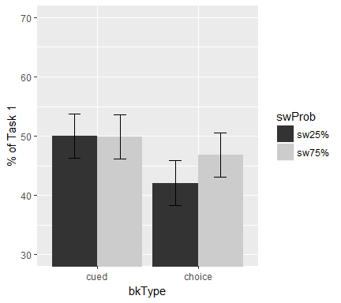

    knitr::opts_chunk$set(fig.width=6, fig.height=4, fig.path='figure/', echo = FALSE, warning = FALSE, message = FALSE)

#### First, Set up the environment and load the data: validgpData.csv

This file came from python scripts - cleaning and preprocessing

#### Set up some formating for the plots

Set up some good format, here I am using apatheme with white background,
with black axis lines, no grids.

#### First summarize individual subject's data

#### Then, calculate the group mean and within-subject SEM using "getWSSE" (a function I wrote)

    ## [1] "Group means:"

    ## [1] "cued: swCost:75% = 103.29 ms"

    ## [1] "cued: swCost:25% = 114.17 ms"

    ## [1] "choice: swCost:75% = 151.76 ms"

    ## [1] "choice: swCost:25% = 139.67 ms"

### RESULTS:

#### Figure 1: ISSP(swProb x trialtype) effect in **RT** by block type (cued vs. choice)

#### 3-way ANOVA: RT ~ 2 bkType x 2 swProb x 2 trialType

    ## $ANOVA
    ##                    Effect DFn DFd          SSn       SSd            F
    ## 1             (Intercept)   1  24 1.192958e+08 869551.23 3.292618e+03
    ## 2                  bkType   1  24 2.478131e+05 463463.93 1.283274e+01
    ## 3                  swProb   1  24 2.541207e-01  85830.72 7.105728e-05
    ## 4               trialType   1  24 8.092959e+05 117550.12 1.652325e+02
    ## 5           bkType:swProb   1  24 5.167458e+01  80368.94 1.543121e-02
    ## 6        bkType:trialType   1  24 1.709452e+04 107155.80 3.828711e+00
    ## 7        swProb:trialType   1  24 4.590025e+00  76474.49 1.440488e-03
    ## 8 bkType:swProb:trialType   1  24 1.649095e+03  44476.01 8.898789e-01
    ##              p p<.05          ges
    ## 1 3.333935e-27     * 9.847708e-01
    ## 2 1.502351e-03     * 1.184188e-01
    ## 3 9.933440e-01       1.377444e-07
    ## 4 2.971338e-12     * 3.049152e-01
    ## 5 9.021737e-01       2.800907e-05
    ## 6 6.211335e-02       9.180901e-03
    ## 7 9.700385e-01       2.487986e-06
    ## 8 3.549102e-01       8.930823e-04

#### 2-way ANOVA: RT ~ 2 swProb x 2 trialType \[cued condition only\]

    ## $ANOVA
    ##             Effect DFn DFd          SSn       SSd            F
    ## 1      (Intercept)   1  24 6.520901e+07 679809.59 2.302139e+03
    ## 2           swProb   1  24 2.234060e+01   8823.03 6.076986e-02
    ## 3        trialType   1  24 2.955749e+05  30761.56 2.306060e+02
    ## 4 swProb:trialType   1  24 7.398401e+02  10000.18 1.775584e+00
    ##              p p<.05          ges
    ## 1 2.356658e-25     * 9.889382e-01
    ## 2 8.073796e-01       3.062803e-05
    ## 3 8.302331e-14     * 2.883744e-01
    ## 4 1.952068e-01       1.013293e-03

#### 2-way ANOVA: RT ~ 2 swProb x 2 trialType \[choice condition only\]

    ## $ANOVA
    ##             Effect DFn DFd          SSn      SSd            F            p
    ## 1      (Intercept)   1  24 5.433463e+07 653205.6 1.996356e+03 1.279693e-24
    ## 2           swProb   1  24 2.958810e+01 157376.6 4.512197e-03 9.470005e-01
    ## 3        trialType   1  24 5.308155e+05 193944.4 6.568673e+01 2.505048e-08
    ## 4 swProb:trialType   1  24 9.138445e+02 110950.3 1.976765e-01 6.605866e-01
    ##   p<.05          ges
    ## 1     * 9.798832e-01
    ## 2       2.652437e-05
    ## 3     * 3.224309e-01
    ## 4       8.185705e-04

#### Figure 2: ISSP(swProb x trialtype) effect in **accuracy** by block type (cued vs. choice)

#### 3-way ANOVA: Accuracy ~ 2 bkType x 2 swProb x 2 trialType

    ## $ANOVA
    ##                    Effect DFn DFd          SSn        SSd            F
    ## 1             (Intercept)   1  24 1.522681e+02 1.76912423 2065.6744370
    ## 2                  bkType   1  24 3.377378e-01 1.46443825    5.5350283
    ## 3                  swProb   1  24 4.140179e-03 0.10222062    0.9720574
    ## 4               trialType   1  24 1.361833e-01 0.46204240    7.0738074
    ## 5           bkType:swProb   1  24 4.028600e-03 0.08230574    1.1747225
    ## 6        bkType:trialType   1  24 1.302396e-02 0.40228217    0.7770046
    ## 7        swProb:trialType   1  24 1.721430e-02 0.14955294    2.7625208
    ## 8 bkType:swProb:trialType   1  24 2.876891e-02 0.15084067    4.5773718
    ##              p p<.05          ges
    ## 1 8.535278e-25     * 0.9707824025
    ## 2 2.717454e-02     * 0.0686382936
    ## 3 3.340036e-01       0.0009026002
    ## 4 1.371498e-02     * 0.0288585656
    ## 5 2.892017e-01       0.0008782962
    ## 6 3.868018e-01       0.0028338644
    ## 7 1.095040e-01       0.0037422209
    ## 8 4.277208e-02     * 0.0062384117

#### 2-way ANOVA: Accuracy ~ 2 swProb x 2 trialType \[cued condition only\]

    ## $ANOVA
    ##             Effect DFn DFd          SSn        SSd            F
    ## 1      (Intercept)   1  24 8.347417e+01 0.09081561 2.205986e+04
    ## 2           swProb   1  24 3.810395e-07 0.01377896 6.636893e-04
    ## 3        trialType   1  24 3.248895e-02 0.02315710 3.367152e+01
    ## 4 swProb:trialType   1  24 7.376924e-04 0.01048868 1.687973e+00
    ##              p p<.05          ges
    ## 1 4.376876e-37     * 9.983467e-01
    ## 2 9.796601e-01       2.756347e-06
    ## 3 5.545300e-06     * 1.902951e-01
    ## 4 2.062114e-01       5.307978e-03

#### 2-way ANOVA: Accuracy ~ 2 swProb x 2 trialType \[choice condition only\]

    ## $ANOVA
    ##             Effect DFn DFd          SSn       SSd          F            p
    ## 1      (Intercept)   1  24 69.131683952 3.1427469 527.933202 7.518063e-18
    ## 2           swProb   1  24  0.008168398 0.1707474   1.148138 2.945967e-01
    ## 3        trialType   1  24  0.116718303 0.8411675   3.330180 8.049244e-02
    ## 4 swProb:trialType   1  24  0.045245513 0.2899049   3.745684 6.481156e-02
    ##   p<.05         ges
    ## 1     * 0.939592374
    ## 2       0.001834468
    ## 3       0.025588908
    ## 4       0.010077373

#### Figure 3: Voluntary task-switching rate: 2 run x 2 swProb

#### ANOVA: switch rate ~ 2 run x 2 swProb

    ## $ANOVA
    ##         Effect DFn DFd          SSn        SSd           F            p
    ## 1  (Intercept)   1  24 5.2704980354 2.91267797 43.42805967 8.137209e-07
    ## 2        runId   1  24 0.0087895697 2.52122643  0.08366947 7.748689e-01
    ## 3       swProb   1  24 0.0004085128 0.10742147  0.09126953 7.651719e-01
    ## 4 runId:swProb   1  24 0.0032841648 0.09488978  0.83064750 3.711493e-01
    ##   p<.05          ges
    ## 1     * 4.832343e-01
    ## 2       1.557053e-03
    ## 3       7.247472e-05
    ## 4       5.823504e-04

    ## # A tibble: 1 x 1
    ##   pval_ttest
    ##        <dbl>
    ## 1  0.2911198

Additional analyses
-------------------

#### Figure 4: Voluntary task-switching rate: 4 run x 2 swProb

 \#\#\#\# Figure 5:Task Ratio: 2 run x 2 swProb

